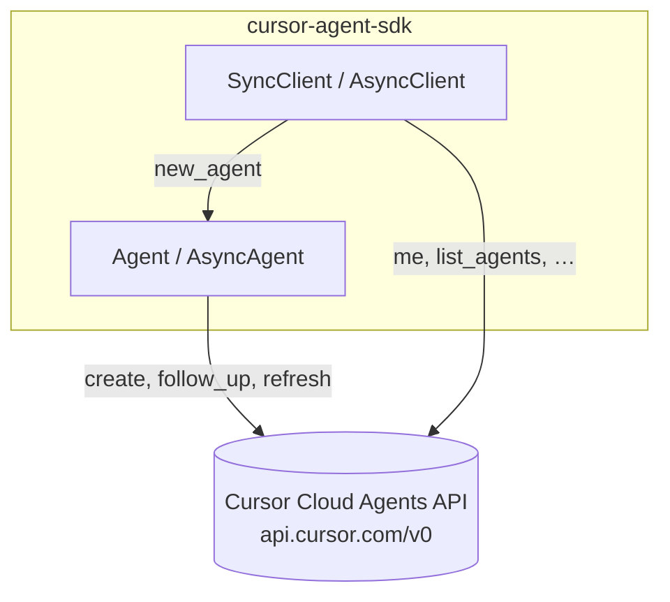

# cursor-agent-sdk

Thin, typed Python bindings for the **[Cursor Cloud Agents API](https://cursor.com/docs/cloud-agent/api/endpoints)**—drive cloud coding agents from CI, bots, or scripts instead of clicking through the dashboard. Built on [httpx](https://www.python-httpx.org/); **sync by default**, **async when you already use asyncio**.

Python **3.10+**.

---

## Install

Install from **[PyPI](https://pypi.org/project/cursor-agent-sdk/)** (recommended):

```bash
pip install cursor-agent-sdk
```

**From source** (contributors or a git checkout):

```bash
git clone <repository-url> && cd cursor-agent-api && pip install -e .
```

---

## Auth

Keys live in the Cursor Dashboard → **Cloud Agents**. The API uses **Basic auth**: username = API key, password empty (`curl -u 'KEY': …`). [Overview](https://cursor.com/docs/api).

---

## 30-second run

```python
import os
from cursor_agent import SyncClient

with SyncClient(os.environ["CURSOR_API_KEY"]) as client:
    agent = client.new_agent(repo="https://github.com/octocat/Hello-World", ref="main")
    print(agent.create("Add a one-line note to README.md."))
```

`create` starts the remote agent; `follow_up("…")` sends more prompts on the **same** run.

---

## Model: client → agent → API

One **client** (connection + credentials). One **agent** handle per repo/PR you care about. Methods map 1:1 to `https://api.cursor.com/v0`.



**Opinions:** Prefer `Agent.create` / `follow_up` over raw `launch_agent` / `followup`—they keep ids and sources straight. Use **`SyncClient`** unless your app is already async; then **`AsyncClient`**. This repo is **not** official Cursor software.

---

## Example (sync)

```python
import os
from cursor_agent import SyncClient

with SyncClient(os.environ["CURSOR_API_KEY"]) as client:
    agent = client.new_agent(repo="https://github.com/octocat/Hello-World", ref="main")
    out = agent.create(
        "Add CONTRIBUTING.md with PR guidelines.",
        target={"autoCreatePr": True},
    )
    print(out.get("id"), out.get("status"))
    agent.follow_up("Ask for a minimal repro in issues.")
    print(agent.refresh().get("status"))
```

**Resume later:** `agent.attach("bc_…")` then `follow_up` / `refresh` only.

---

## Async

Same API; `await` client and `AsyncAgent` methods.

```python
async def run():
    async with AsyncClient(os.environ["CURSOR_API_KEY"]) as client:
        a = client.new_agent(repo="https://github.com/octocat/Hello-World", ref="main")
        await a.create("Update README.")
        await a.follow_up("Keep it short.")
```

---

## Lifecycle

| Call | Role |
|------|------|
| `new_agent(repo=…, ref=…)` or `new_agent(pr_url=…)` | Bind GitHub source. |
| `create(prompt, …)` | **Once** per handle — `POST /v0/agents`, stores `id`. |
| `follow_up(prompt, …)` | Same cloud agent — `POST /v0/agents/{id}/followup`. |

First `create` only: `model`, `target`, `webhook`, `images`. Follow-ups: `prompt` and `images` only.

**PR instead of branch:**

```python
agent = client.new_agent(pr_url="https://github.com/octocat/Hello-World/pull/42")
agent.create("Small doc fixes only.")
```

---

## HTTP surface

| Client method | Route |
|---------------|--------|
| `me` | `GET /v0/me` |
| `list_models` | `GET /v0/models` |
| `list_repositories` | `GET /v0/repositories` |
| `list_agents` | `GET /v0/agents` |
| `get_agent` / `get_conversation` | `GET /v0/agents/{id}…` |
| `launch_agent` | `POST /v0/agents` |
| `followup` | `POST /v0/agents/{id}/followup` |
| `stop_agent` / `delete_agent` | `POST` / `DELETE` … |

---

## Advanced

**Custom httpx** — `SyncClient.from_httpx_client(httpx.Client)` / `AsyncClient.from_httpx_client(httpx.AsyncClient)` for proxies, retries, tracing, etc.

**Errors** — failed requests raise `CursorAPIError` with `status_code` and `response`.

---

## Docs

- **HTML documentation (Sphinx):** `https://aidmet.github.io/cursor-agent-api/`  
- **Package on PyPI:** [cursor-agent-sdk](https://pypi.org/project/cursor-agent-sdk/)  
- **Cursor Cloud Agents API (endpoints)** — [cursor.com/docs](https://cursor.com/docs/cloud-agent/api/endpoints)  
- **Cursor APIs overview** — [cursor.com/docs/api](https://cursor.com/docs/api)  

Unofficial package; not maintained by Cursor.

## License

MIT
